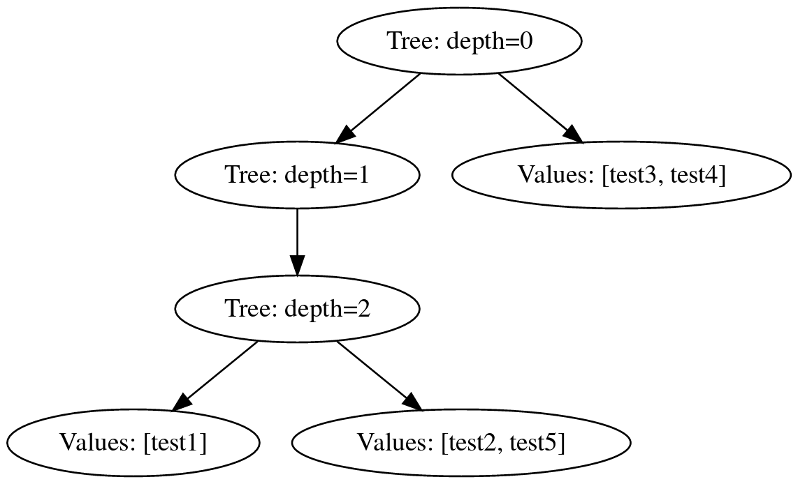

playground for [irmin-pack](https://ocaml.org/p/irmin-pack/) inodes

``` sh
dune exec ./main.exe
```

```
exploring inodes

inode concrete representation:
{
  "Tree": {
    "depth": 0,
    "length": 5,
    "pointers": [
      {
        "index": 0,
        "pointer": "58fac27ac2ddb135d7d93605d25623e4b0dcd5745a846ab578073d4562b7960f31a26ade18c7639454e392a0942a6a72f78cb5a1dae346c81a28b594d5d97243",
        "tree": {
          "Values": [
            {
              "name": "test3",
              "key": {
                "Contents": "8c747f74fe5188b642ebef75eac0da45127f21ce7f977dea7a74cfcbe47d1df936b207cc19963d2a2507f2132da58e757a9c57b134e75b5809e56dea9c51ad90"
              }
            },
            {
              "name": "test4",
              "key": {
                "Contents": "a493b60ec82afc264291d4aeb92bf0c54b0aeb5d7a70420690149a886d9e5dd88d92b54adfd0886e0a35ec48defad09deeb788950a0570fed616dca4054a199d"
              }
            }
          ]
        }
      },
      {
        "index": 1,
        "pointer": "b2a853fb787b4d3665da3ea7f10314a8acdba21f0597b2d924984a0e4075d6bda65f61ce22d2ee1ec1812785c5b6e5934da908e11dcaa45d4695751091b8bc2b",
        "tree": {
          "Tree": {
            "depth": 1,
            "length": 3,
            "pointers": [
              {
                "index": 1,
                "pointer": "cae26be62b2fb71e9b2fef483de869e92adf9869c27d59aab9fd9edf3371351df4b12b74e85a2c64366acbaf707af55acbd9009f8eab1fffb703706baa1f1cf9",
                "tree": {
                  "Tree": {
                    "depth": 2,
                    "length": 3,
                    "pointers": [
                      {
                        "index": 0,
                        "pointer": "0a87943165fc776321a21c309be8d90fa89f79d75330564c2b11a67e614e423637b0696196bfcde860126cdc80e00b9f6fa73f51c1a13f4572b222061a250743",
                        "tree": {
                          "Values": [
                            {
                              "name": "test1",
                              "key": {
                                "Contents": "71aeb9637b90901f7d0520e20a626f79cdd2261f0a5e042cc696e0753bd007c434637e8eeb6d0f8add787463c75e81df0f15b95637fc8cb2c6ec484b42d1b90e"
                              }
                            }
                          ]
                        }
                      },
                      {
                        "index": 1,
                        "pointer": "eff3974a258276ea6219b3a6cd005e5d0aaca88887ee9df916b03d6c87f28cd5c7cb48cb7caa66a96274e59b9c4212d2ecd3426d172ce433edc3b7231a270634",
                        "tree": {
                          "Values": [
                            {
                              "name": "test2",
                              "key": {
                                "Contents": "4aa64f0d1f73b0b7941a5a91f3fb3c10e4364ef9194e86db8a10f47ae8a6b7471d71308a2f17596573578174ab3e319410d8f8ccf9522424c35dc703b6cce370"
                              }
                            },
                            {
                              "name": "test5",
                              "key": {
                                "Contents": "45b2ad23a37ab3733a5c9f5729c8e705dc06da70de1cb891e4dd35736525d43ad276e4e2b01414090f35b559f2b5be48abc0da97dc36a6c7d08425760a66109b"
                              }
                            }
                          ]
                        }
                      }
                    ]
                  }
                }
              }
            ]
          }
        }
      }
    ]
  }
}
inode hash = a615d25db77815109135e4202b6ba0dcce546502f516cd2e0625923e01232970864c592664b5f180a7ae6f89fe847757b04b89c48878fef9b46d4d27d4315e24
```



[discussion of inode tree balancing behavior](https://github.com/mirage/irmin/issues/1806)
